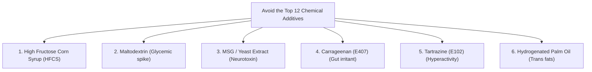

# Smart Label Reader
*The Parent's Practical Guide to Decoding Food Labels & Scanning Preservatives*

---

## Introduction: The Marketing Illusion
The front of a food package is designed to sell. Phrases like *"Made with Whole Grains,"* *"Rich in Vitamin D,"* and *"No Added Sugar"* are marketing claims that often hide high levels of corn syrups, hydrogenated fats, and chemical stabilizers.

This guide empowers parents to read the back of the package (the Ingredient List and Nutrition Table) to understand exactly what is entering their child's body.

---

## Section 1: The Ingredient List Hierarchy
Ingredients are listed in order of weight, from highest to lowest. If any of the following ingredients appear in the first three items, the product is highly processed:

*   **Refined Wheat Flour (Maida)**
*   **Sugar (or any of its 50+ aliases)**
*   **Refined Palm Oil or Hydrogenated Vegetable Fats**

---

## Section 2: The Top 12 Toxins to Avoid
Scan the ingredient list for these chemicals. If any of these are present, return the box to the shelf:

### The Breakdown:
1.  **High Fructose Corn Syrup (HFCS):** Cheap liquid sugar linked to childhood obesity and fatty liver.
2.  **Maltodextrin:** A starch powder used as a filler. It has a glycemic index of 110 (higher than white sugar!), causing instant insulin spikes.
3.  **Monosodium Glutamate (MSG) / E621 / Hydrolyzed Vegetable Protein:** Flavor enhancers that over-stimulate a child's brain receptors, leading to food addiction.
4.  **Carrageenan (E407):** A thickener derived from seaweed that causes gut inflammation, bloating, and food intolerances.
5.  **Synthetic Colors (Tartrazine E102, Sunset Yellow E110, Allura Red E129):** Chemical dyes linked to hyperactivity and focus issues in children. (Banned or warning-labeled in the EU).
6.  **Sodium Benzoate (E211) & Potassium Sorbate (E202):** Strong chemical preservatives that can damage cellular DNA.

---

## Section 3: The Sugar Alias Matrix
Sugar hides under many scientific names. Here is a cheat sheet to identify hidden sugars in ingredients:

| Common Name | Technical / Alias Name | Glycemic Impact | Health Concern |
| :--- | :--- | :--- | :--- |
| **Corn Syrup** | Corn Syrup Solids, HFCS | Extreme (GI: 115) | Liver stress |
| **Liquid Sugar** | Invert Sugar, Golden Syrup, Date Syrup (refined) | High (GI: 70) | Dental cavities |
| **Starch Sugar** | Dextrose, Maltose, Glucose Syrup | High (GI: 100) | Instant insulin surge |
| **Artificial Sweetener** | Sucralose (E955), Aspartame (E951), Acesulfame K | Zero calorie but alters gut microbiome | Distorts sweet taste perception |
| **Chemical Sweetener** | Sorbitol, Maltitol, Xylitol (Sugar Alcohols) | Low | Causes laxative effects & gas in kids |
| **Healthy Sweetener** | Raw Honey, Real Dates, Jaggery (organic) | Moderate (GI: 50-60) | Provides trace minerals & fiber |
