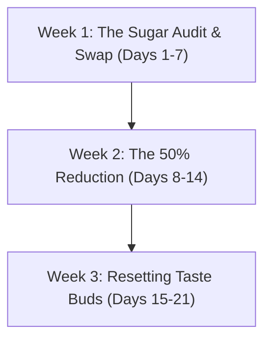

# Sugar Detox for Kids: 21-Day Reset Plan
*A Step-by-Step Parent's Guide to Weaning Kids Off Processed Sugars Without Tantrums*

---

## Introduction: The Sugar Cycle
Refined sugar triggers dopamine release in a child's brain, establishing a highly addictive cycle of sugar spikes, energy crashes, and intense cravings. Breaking this cycle cold turkey causes severe tantrums and sneaky eating behaviors.

This 21-day plan is structured as a gradual reduction system, allowing the child's taste receptors to adjust to natural sweetness levels without feeling deprived.

---

## Section 1: The 21-Day Reset Timeline

### Week 1: The Sugar Audit & Swap (Days 1-7)
*   **Goal:** Identify hidden sugars and replace them with natural sweet alternatives.
*   **Action Steps:**
    *   **Swap Store Juice:** Replace packaged juices with whole fruits or water infused with sweet fruits (strawberries, orange slices).
    *   **Change Spreads:** Replace Nutella or commercial jam with homemade date syrup, pure nut butter, or mashed fresh strawberries with chia seeds.
    *   **The Cupboard Clear-out:** Move sweet biscuits and chocolates out of sight. Replace them with dried fruits (raisins, figs) on the kitchen counter.

---

### Week 2: The 50% Reduction (Days 8-14)
*   **Goal:** Cut the sugar concentration in daily sweets in half.
*   **Action Steps:**
    *   **Dilution Method:** If cooking home desserts (like kheer or halwa), use half the sugar and replace the sweetness with mashed banana or cardamom powder.
    *   **Dilute Milk Drinks:** If using commercial milk powders (Boost, Bournvita, Complan), cut the scoop size to half, adding a pinch of cocoa powder and ground cinnamon instead.
    *   **Introduce Savory Swaps:** Replace one sweet afternoon snack with a savory option (like baked makhana or spiced roasted chickpeas).

---

### Week 3: Resetting Taste Buds (Days 15-21)
*   **Goal:** Re-sensitize taste buds to appreciate natural sweetness (fruits, dairy).
*   **Action Steps:**
    *   **Zero Refined Sugar:** Eliminate all white sugar, brown sugar, and corn syrups from home cooking.
    *   **Natural Fruits Only:** Cravings must be met with whole fruits, dates, or frozen yogurt drops.
    *   **Celebration Swap:** On Day 21, celebrate with a homemade sugar-free dessert like Sweet Potato Fudge Brownies (recipe in the Snack Vault).

---

## Section 2: Coping with Tantrums & Cravings
When a child requests sugar and throws a tantrum, use these psychological techniques:

*   **The Delay Method:** "Yes, you can have a treat, but we are going to eat this sweet banana first. If you still want the chocolate in 15 minutes, we will talk." (Most cravings pass in 10-12 minutes).
*   **The Hydration Check:** Dehydration mimics sugar cravings. Offer a cool glass of lemon water with mint before discussing snacks.
*   **Physical Distraction:** Take the child to play outdoors or start an art activity. Dopamine from physical movement overrides sugar cravings.

---

## Section 3: Sweetness Replacement Matrix
Use these natural sweeteners to completely replace white sugar in home baking and cooking:

| Natural Sweetener | Best Used In | Sweetness Equivalence | Pediatric Benefit |
| :--- | :--- | :--- | :--- |
| **Pitted Date Paste** | Cakes, brownies, milkshakes | 1 cup paste = 1 cup sugar | High in fiber, potassium, and iron |
| **Mashed Ripe Bananas** | Pancakes, muffins, cookies | 1 banana = 1/2 cup sugar | Provides instant energy and vitamin B6 |
| **Cardamom & Cinnamon** | Porridge, kheer, oats | 1 tsp spice enhances sweetness perception | Regulates blood sugar and boosts digestion |
| **Organic Date Powder** | Milk mixes, tea, desserts | 1 tbsp powder = 1 tbsp sugar | Dry, shelf-stable powder rich in minerals |
| **Mango or Chikoo Puree** | Curd, yogurts, puddings | 1/2 cup puree = 1/3 cup sugar | High in vitamin A and dietary fiber |
