# Weekend Batch Cooking Blueprint
*The 2-Hour Sunday Prep Plan to Run Your Kitchen on Auto-Pilot All Week*

---

## Introduction: The Meal Prep Secret
The biggest reason parents resort to store-bought biscuits, packaged foods, and instant noodles during the week is decision fatigue and lack of time. By dedicating **2 hours on Sunday afternoon**, you can prepare all the foundational sauces, doughs, and veggie purees, cutting down weekday cooking time to under 10 minutes per meal.

---

## Section 1: The 2-Hour Sunday Workflow

```mermaid
gantt
    title Sunday Prep Timeline (120 Minutes)
    dateFormat  m
    axisFormat %M
    section Step-by-Step
    Boil & Roast (Eggs, Beans, Makhanas) :active, 0, 30
    Veggie Chopping & Pureeing          :30, 60
    Dough Kneading & Sauce Simmering    :60, 90
    Portioning & Labeling               :90, 120
```

### Phase 1: Boil & Roast (Minutes 0–30)
*   **Boil Chickpeas & Kidney Beans:** Boil 2 cups of chickpeas and kidney beans. Once cooled, store in airtight containers. (Use for quick salads, hummus, or curries).
*   **Boil Eggs:** Boil 6 eggs. Keep them in their shells and refrigerate.
*   **Roast Makhanas:** Dry roast a large batch of makhanas in ghee and store in a glass jar.

---

### Phase 2: Chopping & Pureeing (Minutes 30–60)
*   **The Veggie Puree Base (Stealth Veggie Hack):** Boil bottle gourd (lauki), carrots, and tomatoes together. Blend into a smooth orange puree. Portion into three glass jars.
    *   *Jar A:* Use for pasta sauce on Tuesday.
    *   *Jar B:* Use to knead roti dough on Wednesday.
    *   *Jar C:* Add to dal tadka on Thursday.
*   **Chop Raw Veggies:** Mince carrots, capsicum, and cabbage. Store in containers lined with paper towels (absorbs moisture and keeps veggies crisp for 5 days).

---

### Phase 3: Kneading & Sauces (Minutes 60–90)
*   **Stealth Doughs:** Knead whole wheat flour mixed with sattu powder or spinach puree. Wrap tightly in cling wrap and refrigerate.
*   **Prepare Hummus / Spreads:** Blend boiled chickpeas, sesame seeds, garlic, olive oil, and lemon juice into hummus. Store in a glass jar.

---

### Phase 4: Portioning & Storage (Minutes 90–120)
*   **Store in Glass:** Use glass containers instead of plastic to keep purees fresh and prevent chemical leaching.
*   **Label Everything:** Write the prep date on masking tape and stick it to the jars.

---

## Section 2: Storage & Freezing Guidelines
Use this chart to ensure safety and freshness:

| Prep Item | Fridge Life (4°C) | Freezer Life (-18°C) | Best Reheating Method |
| :--- | :--- | :--- | :--- |
| **Stealth Veggie Puree** | 3 Days | 1 Month | Simmer in a hot pan for 2 minutes |
| **Kneaded Dough** | 2 Days | Do Not Freeze | Let sit at room temp for 15 mins, then roll |
| **Boiled Chickpeas** | 4 Days | 2 Months | Steam or rinse in warm water |
| **Boiled Eggs (in shell)**| 5 Days | Do Not Freeze | Peel and slice immediately |
| **Hummus / Spreads** | 5 Days | Do Not Freeze | Serve cold or at room temperature |
| **Homemade Nut Butter** | 1 Month | 3 Months | Stir well (oil separation is natural) |
| **Baked Oat Cookies** | 7 Days | 2 Months | Warm in oven for 60 seconds |
